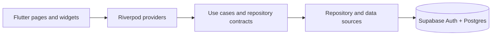

# ReturnPal Flutter prototype

A cross-platform Flutter prototype for tracking retail returns, deadlines, and item status.

The project demonstrates a layered Flutter application backed by Supabase. It is an active prototype: the dashboard, authentication, return-item data flow, calendar views, and manual entry are implemented; receipt capture and scanning screens currently use simulated data and should not be treated as production OCR or barcode features.

## Implemented

- Supabase email/password authentication and persisted sessions
- Create, read, update, delete, and filter return items
- Dashboard summaries for pending, completed, expired, and urgent returns
- Calendar and deadline-oriented views
- Manual item entry and item detail flows
- Riverpod providers over repository and data-source layers
- Material 3 light and dark themes
- Connection diagnostics for Supabase development

## Architecture



The main source tree follows this split:

```text
lib/
├── core/          configuration, errors, theme, and utilities
├── data/          Supabase data sources and repository implementations
├── domain/        entities, contracts, and use cases
└── presentation/  pages, reusable widgets, and Riverpod providers
```

## Run locally

Requirements:

- Flutter 3.27 or another Dart 3.6-compatible stable release
- A Supabase project
- Platform tooling for the target you want to run

Install dependencies:

```bash
flutter pub get
```

Apply the SQL migrations in [`supabase/migrations`](supabase/migrations) to your Supabase project, then run with the public client configuration supplied at build time:

```bash
flutter run \
  --dart-define=SUPABASE_URL=https://your-project.supabase.co \
  --dart-define=SUPABASE_ANON_KEY=your-public-anon-key
```

Never commit service-role keys. The public anon key is intended for client applications, but database access must still be protected with Row Level Security policies.

See [SETUP.md](SETUP.md) for platform and database details.

## Quality checks

```bash
flutter analyze
flutter test
```

## Current limitations

- Receipt scanning and photo capture are UI prototypes with simulated results.
- Reminder scheduling is represented in domain/UI logic; native push or local notification delivery is not wired up.
- There is no offline database or background synchronization layer.
- Social sign-in, biometric authentication, PDF/CSV export, and cloud backup are not implemented.
- Production readiness still requires end-to-end tests, observability, hardened RLS review, and release configuration.

## Tech stack

Flutter · Dart · Riverpod · Supabase · Material 3
